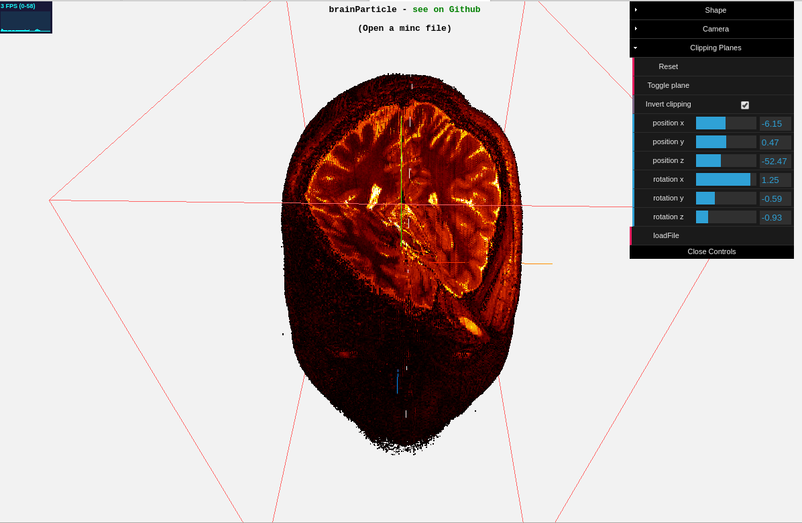

[DEMO](https://jonathanlurie.github.io/brainParticles/) (you need your own minc file)

# brainParticles
Display a minc file as a point cloud and perform some clipping to get some arbitrary obliques.

**Note:** this is a rather resource-intensive tool.

# License
MIT
