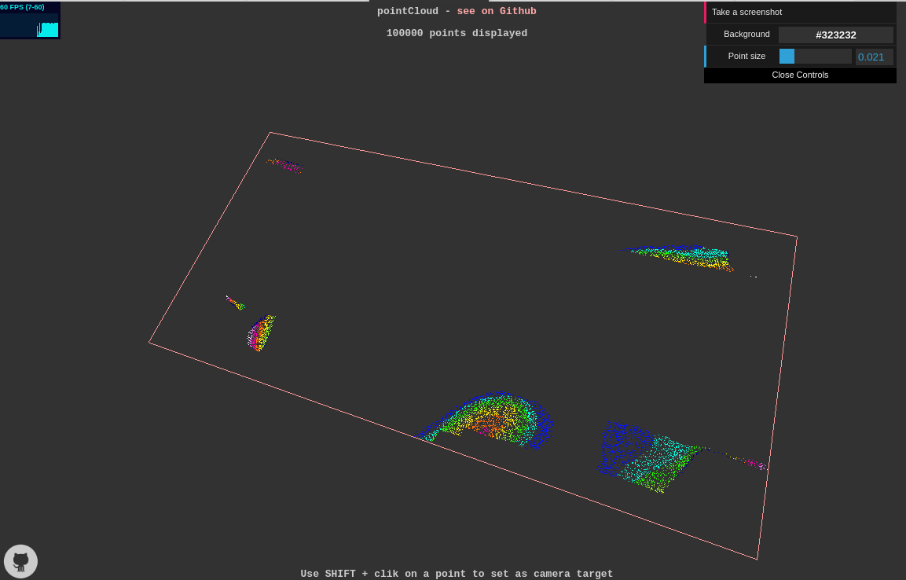

 [[DEMO](https://jonathanlurie.github.io/pointCloud/)] use the data in `testData`.  

**pointCloud** is a web-based (100% browser side) point cloud plotter.



**Point file format:** space separated, x, y, z floats  
```csv
2.73129430362294 -64.04000000000001 6.81367322563185
-15.65018331603530 -64.04000000000001 -5.42032669303416
-15.65542140718940 -64.04000000000001 -5.42512992255479
-15.65861616256700 -64.04000000000001 -5.43266895861949
-15.59795100027330 -64.04000000000001 -5.44439322719899
-15.65464960077280 -64.04000000000001 -5.45528394085953
-15.61122140318850 -64.04000000000001 -5.45533008407816
-15.61825617508640 -64.04000000000001 -5.45731346072274
-15.58112696840820 -64.04000000000001 -5.45370783522877
-15.61242391732740 -64.04000000000001 -5.46258682017240
2.73129430362294 -64.04000000000001 6.81367322563185
-15.65018331603530 -64.04000000000001 -5.42032669303416
-15.65542140718940 -64.04000000000001 -5.42512992255479
-15.65861616256700 -64.04000000000001 -5.43266895861949
-15.59795100027330 -64.04000000000001 -5.44439322719899
-15.65464960077280 -64.04000000000001 -5.45528394085953
-15.61122140318850 -64.04000000000001 -5.45533008407816
-15.61825617508640 -64.04000000000001 -5.45731346072274
...
```

**Color file format:** space separated R G B, each being in [0, 255]
```csv
0 10 25
0 10 25
0 10 25
0 10 25
0 10 25
0 10 25
255 0 0
255 0 0
255 0 0
255 0 0
0 0 255
0 0 255
0 0 255
0 0 255
255 255 0
255 255 0
255 255 0
...
```

Color and point files must have the same number of line.

**Other features:**  
- change the size of the point (for the moment hardcoded in [0.001, 0.1])
- change the background color
- export a screenshot (where UI does not appear)
